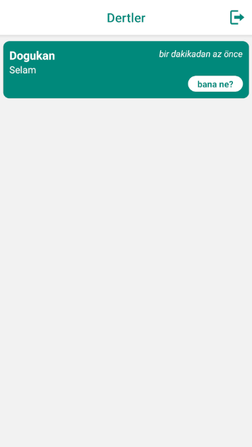

# Bana Ne

**Bana Ne**, kullanıcı girişi ve yeni kullanıcı oluşturma özellikleri sunan bir mesajlaşma uygulamasıdır. Kullanıcılar, bu uygulama aracılığıyla arkadaşlarıyla iletişim kurabilir ve sohbet edebilirler.

## Özellikler

- **Kullanıcı Girişi**:
  - Mevcut kullanıcılar, hesaplarına giriş yaparak uygulamanın mesajlaşma özelliklerine erişebilirler.
  - Giriş yaparken e-posta adresi ve şifre kullanılır.
  - 

- **Yeni Kullanıcı Oluşturma**:
  - Yeni kullanıcılar, uygulamaya kayıt olarak yeni bir hesap oluşturabilirler.
  - Kayıt işlemi için e-posta adresi, kullanıcı adı ve şifre gereklidir.
  -   

- **Mesajlaşma**:
  - Kullanıcılar, arkadaşlarıyla bire bir mesajlaşabilirler.
  - Sohbet geçmişi saklanır ve kullanıcılar geçmiş mesajlarına erişebilirler.
  - 

## Kurulum

1. Projeyi klonlayın:
   ```bash
   git clone https://github.com/Dogukan-Hellac/patika-BanaNe.git
2. Proje dizinine gidin
   ```bash
   cd Bana Ne
